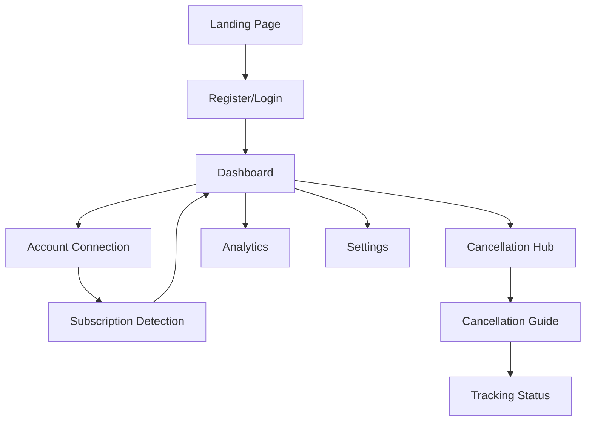

# Subscription Management Application - Product Requirements Document

## 1. Product Overview
A comprehensive subscription management application that automatically detects active subscriptions across multiple platforms and provides intelligent cancellation assistance with a premium Apple Liquid Glass interface.

The application solves the growing problem of subscription sprawl by helping users identify, track, and easily cancel unwanted subscriptions, potentially saving users hundreds of dollars annually while providing exceptional user experience through cutting-edge UI design.

## 2. Core Features

### 2.1 User Roles
| Role | Registration Method | Core Permissions |
|------|---------------------|------------------|
| Free User | Email registration | Can connect up to 3 accounts, basic subscription detection |
| Premium User | Subscription upgrade | Unlimited account connections, advanced analytics, priority support |
| Admin User | Internal invitation | Full system access, user management, analytics dashboard |

### 2.2 Feature Module
Our subscription management application consists of the following main pages:
1. **Dashboard**: Subscription overview cards, spending analytics, quick actions panel
2. **Subscription Detection**: Account connection interface, platform integration status, refresh controls
3. **Cancellation Hub**: Active subscriptions list, cancellation guides, tracking status
4. **Analytics**: Spending trends, savings calculator, subscription timeline
5. **Settings**: Account preferences, notification controls, privacy settings
6. **Authentication**: Login/register forms, account recovery

### 2.3 Page Details
| Page Name | Module Name | Feature description |
|-----------|-------------|---------------------|
| Dashboard | Overview Cards | Display active subscriptions with cost, next billing date, and quick cancel buttons |
| Dashboard | Spending Analytics | Show monthly/yearly spending trends with visual charts and savings opportunities |
| Dashboard | Quick Actions | Provide one-click access to most common tasks like refresh, add account, view savings |
| Subscription Detection | Account Connection | Connect user accounts from major platforms (Apple, Google, banking APIs) with OAuth integration |
| Subscription Detection | Platform Integration | Support Netflix, Spotify, Adobe, Microsoft, AWS, and 50+ major subscription services |
| Subscription Detection | Auto Refresh | Periodic background sync every 24 hours with manual refresh option |
| Cancellation Hub | Subscription List | Display all detected subscriptions with service logos, costs, and cancellation difficulty ratings |
| Cancellation Hub | Cancellation Guides | Provide step-by-step visual guides with screenshots for each service's cancellation process |
| Cancellation Hub | Deep Links | Direct links to official cancellation pages with pre-filled information where possible |
| Cancellation Hub | Tracking System | Monitor cancellation completion status and send confirmation notifications |
| Analytics | Spending Trends | Interactive charts showing spending patterns, category breakdowns, and year-over-year comparisons |
| Analytics | Savings Calculator | Calculate potential savings from cancelled subscriptions with projection tools |
| Analytics | Subscription Timeline | Visual timeline of subscription additions and cancellations with spending impact |
| Settings | Account Preferences | Manage connected accounts, notification preferences, and data retention settings |
| Settings | Privacy Controls | Configure data sharing permissions and export/delete personal data |
| Authentication | Login/Register | Secure authentication with email/password, social login, and two-factor authentication |
| Authentication | Account Recovery | Password reset, account verification, and security question recovery |

## 3. Core Process

**User Onboarding Flow:**
New users register → connect their first account → system detects subscriptions → user reviews findings → sets up notifications and preferences.

**Subscription Management Flow:**
User views dashboard → identifies unwanted subscription → accesses cancellation guide → follows step-by-step instructions → confirms cancellation → system tracks completion status.

**Premium User Flow:**
Free user hits limits → views premium benefits → upgrades subscription → gains access to unlimited connections and advanced analytics.

## 4. User Interface Design

### 4.1 Design Style
- **Primary Colors**: Deep Blue (#1A365D), Soft White (#FAFAFA)
- **Secondary Colors**: Accent Green (#38A169), Warning Orange (#ED8936), Error Red (#E53E3E)
- **Button Style**: Rounded corners (12px radius), subtle shadows, frosted glass effect with 80% opacity
- **Typography**: SF Pro Display for headings (24px, 18px), SF Pro Text for body (16px, 14px)
- **Layout Style**: Card-based design with 16px spacing, floating elements with backdrop blur
- **Icons**: SF Symbols style with 2px stroke weight, subtle animations on interaction

### 4.2 Page Design Overview
| Page Name | Module Name | UI Elements |
|-----------|-------------|-------------|
| Dashboard | Overview Cards | Frosted glass cards with subtle blur, smooth hover animations, color-coded status indicators |
| Dashboard | Spending Analytics | Interactive charts with liquid animations, gradient fills, responsive touch interactions |
| Subscription Detection | Account Connection | Floating connection buttons with brand colors, progress indicators with smooth transitions |
| Cancellation Hub | Subscription List | Swipe-to-cancel gestures, difficulty rating badges, smooth list animations |
| Cancellation Hub | Cancellation Guides | Step-by-step modal overlays with screenshot carousels and progress tracking |
| Analytics | Charts | Liquid motion graphics, interactive data points, smooth zoom and pan gestures |
| Settings | Controls | Toggle switches with fluid animations, grouped sections with subtle dividers |

### 4.3 Responsiveness
Mobile-first responsive design with touch-optimized interactions. Desktop version maintains glass morphism effects with hover states. Full accessibility compliance with WCAG 2.1 AA standards, including high contrast mode and screen reader support.