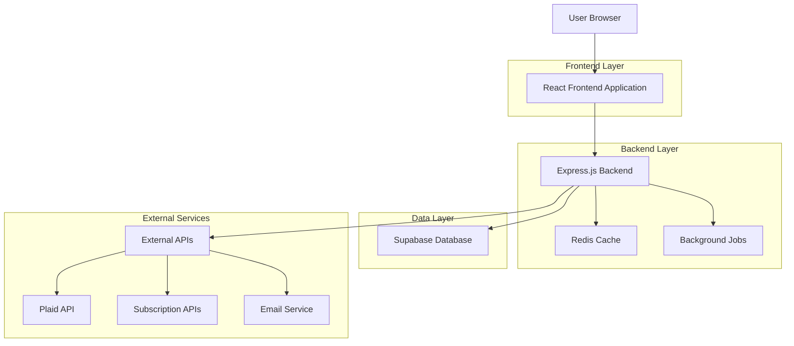
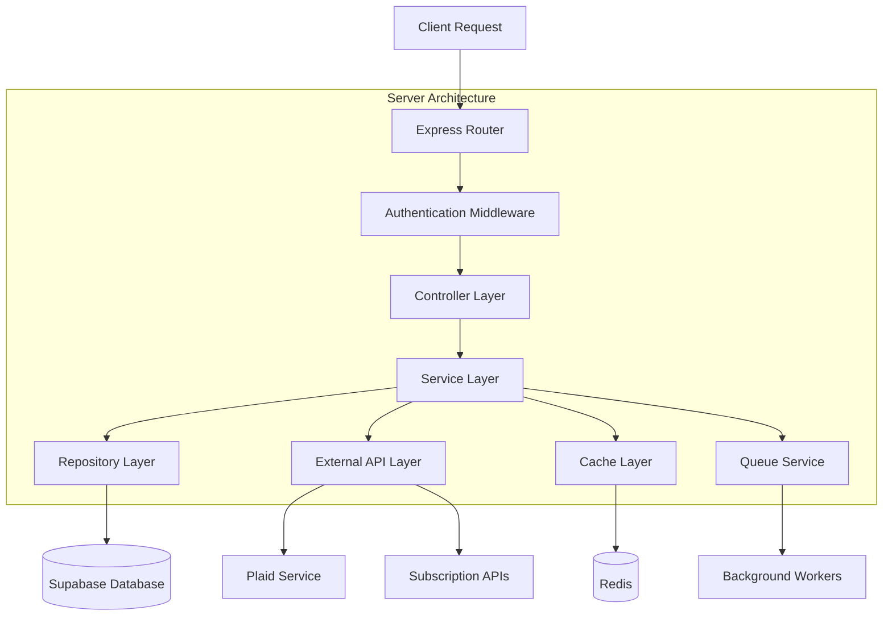
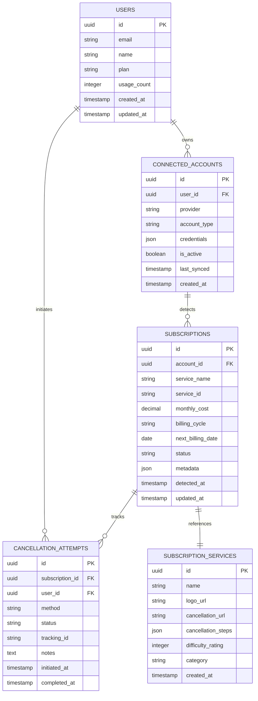

# Subscription Management Application - Technical Architecture Document

## 1. Architecture Design



## 2. Technology Description
- Frontend: React@18 + TypeScript + TailwindCSS@3 + Framer Motion + Vite
- Backend: Express.js@4 + TypeScript + Node.js@18
- Database: Supabase (PostgreSQL)
- Cache: Redis@7
- Authentication: Supabase Auth
- External APIs: Plaid, Banking APIs, Subscription Service APIs
- Background Jobs: Bull Queue + Redis

## 3. Route Definitions
| Route | Purpose |
|-------|---------|
| / | Landing page with hero section and feature overview |
| /auth/login | User authentication and login |
| /auth/register | User registration and account creation |
| /dashboard | Main dashboard with subscription overview |
| /connect | Account connection and platform integration |
| /subscriptions | Detailed subscription management and cancellation hub |
| /analytics | Spending analytics and insights dashboard |
| /settings | User preferences and account settings |
| /guides/:serviceId | Step-by-step cancellation guides for specific services |

## 4. API Definitions

### 4.1 Core API

**User Authentication**
```
POST /api/auth/register
```

Request:
| Param Name | Param Type | isRequired | Description |
|------------|------------|------------|-------------|
| email | string | true | User email address |
| password | string | true | User password (min 8 characters) |
| name | string | true | User full name |

Response:
| Param Name | Param Type | Description |
|------------|------------|-------------|
| success | boolean | Registration status |
| user | object | User profile data |
| token | string | JWT authentication token |

**Account Connection**
```
POST /api/accounts/connect
```

Request:
| Param Name | Param Type | isRequired | Description |
|------------|------------|------------|-------------|
| provider | string | true | Account provider (plaid, apple, google) |
| credentials | object | true | OAuth tokens or credentials |
| accountType | string | true | Type of account (banking, email, platform) |

Response:
| Param Name | Param Type | Description |
|------------|------------|-------------|
| success | boolean | Connection status |
| accountId | string | Unique account identifier |
| subscriptionsFound | number | Number of detected subscriptions |

**Subscription Detection**
```
GET /api/subscriptions/detect
```

Request:
| Param Name | Param Type | isRequired | Description |
|------------|------------|------------|-------------|
| accountId | string | false | Specific account to scan |
| forceRefresh | boolean | false | Force refresh from external APIs |

Response:
| Param Name | Param Type | Description |
|------------|------------|-------------|
| subscriptions | array | List of detected subscriptions |
| lastUpdated | string | ISO timestamp of last scan |
| totalCost | number | Monthly total cost |

**Cancellation Tracking**
```
POST /api/subscriptions/:id/cancel
```

Request:
| Param Name | Param Type | isRequired | Description |
|------------|------------|------------|-------------|
| method | string | true | Cancellation method (guide, direct, assisted) |
| notes | string | false | User notes about cancellation |

Response:
| Param Name | Param Type | Description |
|------------|------------|-------------|
| success | boolean | Cancellation initiation status |
| trackingId | string | Unique tracking identifier |
| estimatedCompletion | string | Estimated completion time |

## 5. Server Architecture Diagram



## 6. Data Model

### 6.1 Data Model Definition



### 6.2 Data Definition Language

**Users Table**
```sql
-- Create users table
CREATE TABLE users (
    id UUID PRIMARY KEY DEFAULT gen_random_uuid(),
    email VARCHAR(255) UNIQUE NOT NULL,
    name VARCHAR(100) NOT NULL,
    plan VARCHAR(20) DEFAULT 'free' CHECK (plan IN ('free', 'premium')),
    usage_count INTEGER DEFAULT 0,
    created_at TIMESTAMP WITH TIME ZONE DEFAULT NOW(),
    updated_at TIMESTAMP WITH TIME ZONE DEFAULT NOW()
);

-- Create connected_accounts table
CREATE TABLE connected_accounts (
    id UUID PRIMARY KEY DEFAULT gen_random_uuid(),
    user_id UUID REFERENCES users(id) ON DELETE CASCADE,
    provider VARCHAR(50) NOT NULL,
    account_type VARCHAR(50) NOT NULL,
    credentials JSONB NOT NULL,
    is_active BOOLEAN DEFAULT true,
    last_synced TIMESTAMP WITH TIME ZONE,
    created_at TIMESTAMP WITH TIME ZONE DEFAULT NOW()
);

-- Create subscription_services table
CREATE TABLE subscription_services (
    id UUID PRIMARY KEY DEFAULT gen_random_uuid(),
    name VARCHAR(100) NOT NULL,
    logo_url TEXT,
    cancellation_url TEXT,
    cancellation_steps JSONB,
    difficulty_rating INTEGER CHECK (difficulty_rating BETWEEN 1 AND 5),
    category VARCHAR(50),
    created_at TIMESTAMP WITH TIME ZONE DEFAULT NOW()
);

-- Create subscriptions table
CREATE TABLE subscriptions (
    id UUID PRIMARY KEY DEFAULT gen_random_uuid(),
    account_id UUID REFERENCES connected_accounts(id) ON DELETE CASCADE,
    service_id UUID REFERENCES subscription_services(id),
    service_name VARCHAR(100) NOT NULL,
    monthly_cost DECIMAL(10,2) NOT NULL,
    billing_cycle VARCHAR(20) DEFAULT 'monthly',
    next_billing_date DATE,
    status VARCHAR(20) DEFAULT 'active',
    metadata JSONB,
    detected_at TIMESTAMP WITH TIME ZONE DEFAULT NOW(),
    updated_at TIMESTAMP WITH TIME ZONE DEFAULT NOW()
);

-- Create cancellation_attempts table
CREATE TABLE cancellation_attempts (
    id UUID PRIMARY KEY DEFAULT gen_random_uuid(),
    subscription_id UUID REFERENCES subscriptions(id) ON DELETE CASCADE,
    user_id UUID REFERENCES users(id) ON DELETE CASCADE,
    method VARCHAR(50) NOT NULL,
    status VARCHAR(20) DEFAULT 'initiated',
    tracking_id VARCHAR(100) UNIQUE,
    notes TEXT,
    initiated_at TIMESTAMP WITH TIME ZONE DEFAULT NOW(),
    completed_at TIMESTAMP WITH TIME ZONE
);

-- Create indexes
CREATE INDEX idx_connected_accounts_user_id ON connected_accounts(user_id);
CREATE INDEX idx_subscriptions_account_id ON subscriptions(account_id);
CREATE INDEX idx_subscriptions_status ON subscriptions(status);
CREATE INDEX idx_cancellation_attempts_user_id ON cancellation_attempts(user_id);
CREATE INDEX idx_cancellation_attempts_status ON cancellation_attempts(status);

-- Grant permissions
GRANT SELECT ON subscription_services TO anon;
GRANT ALL PRIVILEGES ON users TO authenticated;
GRANT ALL PRIVILEGES ON connected_accounts TO authenticated;
GRANT ALL PRIVILEGES ON subscriptions TO authenticated;
GRANT ALL PRIVILEGES ON cancellation_attempts TO authenticated;

-- Insert initial subscription services data
INSERT INTO subscription_services (name, logo_url, cancellation_url, difficulty_rating, category) VALUES
('Netflix', 'https://cdn.example.com/netflix-logo.png', 'https://www.netflix.com/cancelplan', 2, 'streaming'),
('Spotify', 'https://cdn.example.com/spotify-logo.png', 'https://www.spotify.com/account/subscription/', 2, 'music'),
('Adobe Creative Cloud', 'https://cdn.example.com/adobe-logo.png', 'https://account.adobe.com/plans', 4, 'software'),
('Microsoft 365', 'https://cdn.example.com/microsoft-logo.png', 'https://account.microsoft.com/services/', 3, 'software'),
('Amazon Prime', 'https://cdn.example.com/amazon-logo.png', 'https://www.amazon.com/gp/help/customer/display.html', 3, 'shopping');
```